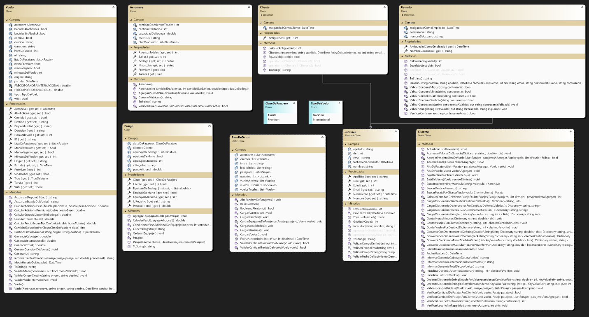

# **QATAR AIRLINES**
Aplicacion para un sistema de aerolineas desarrollada por Alejandro Heidenreich. Si desea ver las consigas de este trabaja puede ingresar al [Enunciado](https://codeutnfra.github.io/programacion_2_laboratorio_2_apuntes/docs/evaluaciones/parciales/2d-primer-parcial2022/).

## Sobre mi:
Hola, soy Alejandro Heidenreich estudiante en Tecnico Universitario en Programacion (UTN-FRA). Disfrute mucho este trabajo, fue un desafio al tener que entender e investigar como plantearia el funcionamiento de la administracion de una aerolinea, con esto aprendi las diferentes posturas para resolver un mismo problema. Me dirvti mucho durante esta experiencia y seguire avanzando en mi aplicacion en el futuo.

## **Resumen**
### Log In
Al correr la apliacion se presenta con una venta para realizar el **Log In**. 


En el cual se le pedira al usuario ingresar su **Nombre de Usuario** y **Contraseña**. El _Nombre de Usuario_ debera ser unico y no repetirse con los demas usuarios, y la _Contraseña_ debera tener un largo de por lo menos ocho digitos, contener una minuscula, una mayuscula, un numero y un simbolo.

Esta ventana consta con tres botones:
* **Ingresar** : Verificando los campos ingresados, ingresara al **Menu Principal** de la apliacion, caso contrario informara un mensaje con el _error_
* **©** _(Autocompletar)_ : Autocompleta los campos _Usuario_ y _Contraseña_ con datos validos para el facil acceso.
* **X** _(Salir)_ : Cerrara la ventanta y terminara con la aplicacion.

Tambien contiene una opcion para si el usuario se olvido la contraseña, haciendo click en este link, mostrara un mensaje y terminara la aplicacion.

### **Menu Principal**
Una vez correctamente el usuario loggeado, tiene acceso a la ventana del **Menu Principal** 


Con esta venta podremos navegar por nuestra aplicacion, consta con un _menu strip_ con los siguientes botones :
* **Inicio** : vuelve a mostrar el fondo del _Menu Principal_ cerrando todos los formularios abiertos, si es que lo hay.
* **Clientes** : abre el formulario _MDI_ para administrar los clintes.
* **Vuelos** : abre el formulario _MDI_ para administrar los vuelos.
* **Cuenta** : despliega dos opciones
    - Configurar Cuenta: abre el formulario _MDI_ para administrar la cuenta del usuario.
    - Cerrar Sesion: cierra el _Menu Principal_ y vuelve al _Log In_.
* **Horario** : muestra o esconde la hora.
* **Cerrar** : cierra la aplicacion.

### **Clientes**

Podremos visualizar una lista de **Clientes** con los datos :

* Nombre
* Apellido
* DNI
* Fecha de Nacimiento
* Edad
* E-Mail

Consta de una caja de texto donde puede filtrar por _Nombre_, _Apellido_ o _DNI_, dependiendo de lo que ingrese el usuario; y de tres botones _Agregar Nuevo Cliente_, _Editar Cliente_ y _Eliminar Cliente_

#### **Agregar Nuevo Cliente**


Este boton abre un formulario que consta con dos botones

* Confirmar : una vez verificado los datos agrega el cliente, caso contrario muestra un mensaje de error ( ningun _Campo_ puede estar vacio, el _Dni_ debe ser de 1.000.000 a 99.999.999, debe ser mayor de 18 y el _E-Mail_ debe contener una @ _"arroba"_ )
* Salir : cierra el formulario sin cargar ningun cliente

#### **Editar Cliente**


Este boton abre un formulario que se inicializa con todos los campos con los datos del cliente seleccionado y consta con dos botones

* Confirmar Edicion : una vez verificado los datos agrega el cliente, caso contrario muestra un mensaje de error ( ningun _Campo_ puede estar vacio, el _Dni_ no se puede editar, debe ser mayor de 18 y el _E-Mail_ debe contener una @ _"arroba"_ )
* Salir : cierra el formulario sin editar el cliente

#### **Eliminar Cliente**
Este boton elimina los datos del cliente seleccionado, antes saltara una ventana para confirmar la accion. Si se confirma la accion, se elimninara el cliente de la base de datos, caso contrario no se hara ningun cambio.

### **Vuelos**

Podremos visualizar una lista de **Vuelos Actuales**, es decir buenos que no pasaron de la fecha, con los datos :

* ID del Vuelo
* Origen
* Destino
* Tipo
* Duracion
* Disponibilidad (Cantidad de pasajeros, Completo, En Vuelo o Finalizado)
* Partida
* Wifii
* Comida
* Menu Vegano
* Menu Premium
* Bebidas Sin Alcohol
* Bebidas Alcoholicas

Consta de una caja de texto donde puede filtrar por _Origen_, _Destino_, o por _Tipo_ ( _Internacional_ o _Nacional_ ), dependiendo de lo que ingrese el usuario; y de cuatro botones :
* Vender Pasaje ( Solo se podra utilizar si la disponibilidad lo permite )
* Agregar Nuevo Vuelo ( Agregara un nuevo vuelo a la lista de vuelos Activos )
* Examinar Vuelo ( Se podra acceder a la informacion mas detallada del vuelo que esta seleccionado )
* Eliminar Vuelo ( Se eliminara el vuelo seleccioando )

#### **Vender Pasaje**


Este boton abre un formulario que muestra informacion del vuelo que se desea vender, un _listbox_ con la lista de clientes en la base de datos, con la opcion de agregar un nuevo cliente haciedo click en el boton _Agregar Nuevo Cliente_.

Una vez seleccionado el cliente deseado, marcando si este cliente va a adquirir un pasaje _Premium_ o por defecto _Tursita_, haciendo click en el boton _Agregar a Compra_, este cliente se convertira en pasajero y se podra visualizar en el _data grid_ mostrando :
* ID de Registro
* Cliente ( Nombre y Apellido )
* Clase ( Premium o Turista )
* Precio Base
* Eliminar ( boton para eliminar pasajero del carrito de compras )

Seleccionado un pasajero del _data grid_ y haciendo click en el boton _Añadir Equipaje al Pasajero_, el usuario podra asignarle equipajes a dicho pasajero mediante el siguiente formulario :
#### Agregar Equipaje 


Figurara los datos del pasajero que se le agregara el equipaje. Un _checkbox_ para detallar que el pasajero llevara equipaje de mano, por defecto no.

Un _NumericUpDown_ para designar un peso al equipaje de bodega, que se agregara al _listbox_ una vez dado click al boton _Agregar Equipaje_ hasta un limite de cuatro equipajes por pasajero.

Tambien cuenta con un boton _Eliminar Equipaje_ para sacarlo de la lista.

Una vez que el usuario haya finalizado con la carga de los equipajes podra dar clic en el boton _Confirmar_ para aceptar la carga o en el boton _Cancelar_ para descartar cualquier accion.

Volviendo a la ventanta anterior podiendo visualizar la facturacion de la operacion _Precio Bruto_, _Adicional por Clase Premium_, _Adicional por Peso Adicional_ y _Precio Final + IVA_.

El usuario puede seguir agregando pasajes hasta un maximo de cinco pasajes por pasajero, permitiendo designar la clase que desea si es posible y si el vuelo no esta completo.

Al momento de estar conforme con la operacion el usuario puede dar click en _Finalizar Compra_, caso contrario el usuario tambien puede cancelar todo el proceso y no realizar ningun cambio pulsando el boton _X ( Salir )_.

### **Agregar Nuevo Vuelo**


## Diagrama de Clases



## Justificación técnica
Indicar tema a tema (de los temas 01 al 09) dónde se fue aplicando en el código y por qué se decidió implementarlo de esa forma. Toda decisión tiene que estar argumentada con razones técnicas que giren alrededor de los pilares de la programación orientada a objetos y cuestiones de mantenibilidad, código limpio, flexibilidad al cambio, experiencia de usuario, accesibilidad, uso seguro, rendimiento y eficiencia.
Suma identificar pros y contras, si los tienen en mente.
El objetivo es que demuestren que saben lo que hacen y que tomaron decisiones con criterio y no mecanizadas.
Si se utilizó alguna biblioteca externa también se deberá justificar la elección.

```bash
codigo
```

### Propuesta de valor agregado 
En esta sección se explicará y justificará la funcionalidad adicional propuesta para el punto de promoción.
